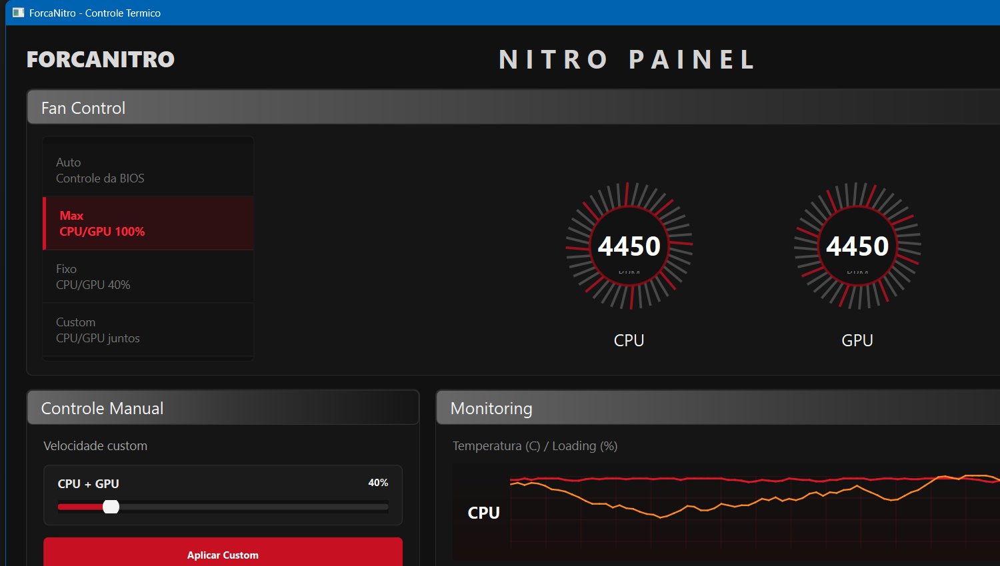

# ForcaNitro

ForcaNitro is a small Windows utility for manual fan control on Acer Nitro notebooks when NitroSense is broken, stuck in the background, or no longer opens correctly.

It was built for a real Acer Nitro 5 setup where the original NitroSense app stopped working, but the embedded controller could still be controlled through `ec-probe.exe`.

> Compatibility note: this project has only been tested on an Acer Nitro 5 AN515-58 family notebook, with NitroSense V31 / NitroSense Service 3.01.3052. It may not work on other Acer Nitro, Predator, or Aspire models without changing the EC addresses.



## What It Does

- Provides a NitroSense-inspired PyQt6 interface.
- Controls CPU and GPU fan speed through NoteBook FanControl's `ec-probe.exe`.
- Offers three quick profiles:
  - `Auto`: returns fan control to BIOS/motherboard logic.
  - `Max`: sets CPU and GPU fans to 100%.
  - `Fixed`: sets CPU and GPU fans to 40%.
- Offers a `Custom` profile with one shared fan speed slider for CPU + GPU.
- Shows animated fan dials and visual monitoring graphs.
- Can redirect the physical NitroSense keyboard button to open/focus ForcaNitro.

## Important Safety Warning

ForcaNitro writes directly to embedded controller registers. This is model-specific and can be risky if used on unsupported hardware.

The current EC writes are:

| Purpose | Address | Value |
| --- | --- | --- |
| Unlock sequence | `0x03` | `0x11` |
| Unlock sequence | `0x22` | `0x0C` |
| Unlock sequence | `0x21` | `0x30` |
| CPU fan speed | `0x37` | percentage as hex |
| GPU fan speed | `0x3A` | percentage as hex |
| Return to BIOS/auto | `0x22` | `0x04` |
| Return to BIOS/auto | `0x21` | `0x10` |

Use this only if you understand the risk. Keep temperatures monitored after changing fan modes.

## Tested Environment

This is the only tested setup so far:

- Notebook: Acer Nitro 5 AN515-58 family
- OS: Windows 11
- NitroSense AppX: `AcerIncorporated.NitroSenseV31`
- NitroSense package seen during testing: `3.1.3052.0`
- NitroSense Service: `3.01.3052`
- Quick Access Service: `3.00.3052`
- Fan backend: NoteBook FanControl `ec-probe.exe`
- Expected `ec-probe.exe` path:

```text
C:\Program Files (x86)\NoteBook FanControl\ec-probe.exe
```

## Requirements

- Windows 10/11
- Python 3.13 tested, other Python 3 versions may work
- PyQt6
- NoteBook FanControl installed, with `ec-probe.exe` available

Install Python dependencies:

```powershell
pip install -r requirements.txt
```

## Running From Source

```powershell
python app_ventoinha.py
```

Opening the app does not change fan speed automatically. Fan commands run only when you click a mode button.

## Building The EXE

Install PyInstaller:

```powershell
pip install pyinstaller
```

Build:

```powershell
python -m PyInstaller --noconfirm --onefile --windowed --name ForcaNitro app_ventoinha.py
```

The generated executable will be:

```text
dist\ForcaNitro.exe
```

## Using The App

1. Install NoteBook FanControl.
2. Confirm `ec-probe.exe` exists at:

```text
C:\Program Files (x86)\NoteBook FanControl\ec-probe.exe
```

3. Run `ForcaNitro.exe` or `python app_ventoinha.py`.
4. Choose a profile:
   - `Auto`: return control to the BIOS.
   - `Max`: run CPU and GPU fans at 100%.
   - `Fixed`: run CPU and GPU fans at 40%.
   - `Custom`: choose one shared percentage for CPU and GPU.
5. Watch temperatures after applying any manual fan profile.

## NitroSense Keyboard Button Redirect

On the tested AN515-58 setup, the physical NitroSense keyboard button is handled by Acer's NitroSense/Quick Access services. When the original NitroSense app is broken, pressing the key can spawn `NitroSense.exe` and leave it stuck in the background.

This project includes a reversible redirect flow:

- `nitrosense_key_redirect.ps1`
  - Keeps Acer's `PSAgent.exe` listener alive.
  - Detects broken `NitroSense.exe` launches.
  - Closes them.
  - Opens or focuses `ForcaNitro.exe`.
- `install_nitrosense_key_redirect.ps1`
  - Installs a scheduled task that starts the redirect watcher at logon.
- `install_nitrosense_task_redirect.ps1`
  - Backs up the original Acer `NitroSense` scheduled task.
  - Redirects that task to `ForcaNitro.exe`.
- `restore_nitrosense_task.ps1`
  - Restores the backed-up Acer scheduled task.
- `uninstall_nitrosense_key_redirect.ps1`
  - Removes the redirect watcher task and related registry leftovers.

Install the keyboard redirect from an elevated PowerShell:

```powershell
powershell.exe -NoProfile -ExecutionPolicy Bypass -File .\install_nitrosense_key_redirect.ps1
powershell.exe -NoProfile -ExecutionPolicy Bypass -File .\install_nitrosense_task_redirect.ps1
```

After installation, press the NitroSense key. It should open or focus ForcaNitro.

To remove the redirect:

```powershell
powershell.exe -NoProfile -ExecutionPolicy Bypass -File .\uninstall_nitrosense_key_redirect.ps1
powershell.exe -NoProfile -ExecutionPolicy Bypass -File .\restore_nitrosense_task.ps1
```

## Notes For Other Models

If you want to test this on another Acer notebook:

1. Do not assume the EC addresses are the same.
2. Back up your current NitroSense/Quick Access tasks before changing anything.
3. Verify the fan registers for your exact model.
4. Test `Auto` first so you know how to return control to BIOS.
5. Share your model, NitroSense version, and working EC addresses if you confirm compatibility.

## Portuguese / PT-BR

ForcaNitro e uma ferramenta pequena para Windows feita para controlar manualmente as ventoinhas de notebooks Acer Nitro quando o NitroSense original para de funcionar, fica preso em segundo plano ou nao abre corretamente.

> Nota de compatibilidade: este projeto foi testado somente em um Acer Nitro 5 da familia AN515-58, com NitroSense V31 / NitroSense Service 3.01.3052. Outros modelos podem usar enderecos EC diferentes.

### O Que Ele Faz

- Interface em PyQt6 inspirada no NitroSense.
- Controle de ventoinhas via `ec-probe.exe` do NoteBook FanControl.
- Perfis rapidos:
  - `Auto`: devolve o controle para a BIOS/placa-mae.
  - `Max`: coloca CPU e GPU em 100%.
  - `Fixo`: coloca CPU e GPU em 40%.
  - `Custom`: usa uma unica barra para CPU + GPU.
- Mostradores animados de ventoinha.
- Redirecionamento opcional da tecla fisica NitroSense para abrir/focar o ForcaNitro.

### Como Usar

1. Instale o NoteBook FanControl.
2. Confirme que o arquivo existe:

```text
C:\Program Files (x86)\NoteBook FanControl\ec-probe.exe
```

3. Rode o app:

```powershell
python app_ventoinha.py
```

Ou gere o executavel:

```powershell
python -m PyInstaller --noconfirm --onefile --windowed --name ForcaNitro app_ventoinha.py
```

4. Abra `dist\ForcaNitro.exe`.
5. Escolha `Auto`, `Max`, `Fixo` ou `Custom`.
6. Monitore as temperaturas depois de aplicar qualquer perfil manual.

### Tecla NitroSense

No notebook testado, a tecla NitroSense passa pelos servicos da Acer. O projeto inclui scripts para fazer essa tecla abrir/focar o ForcaNitro.

Instalar em PowerShell como administrador:

```powershell
powershell.exe -NoProfile -ExecutionPolicy Bypass -File .\install_nitrosense_key_redirect.ps1
powershell.exe -NoProfile -ExecutionPolicy Bypass -File .\install_nitrosense_task_redirect.ps1
```

Remover/restaurar:

```powershell
powershell.exe -NoProfile -ExecutionPolicy Bypass -File .\uninstall_nitrosense_key_redirect.ps1
powershell.exe -NoProfile -ExecutionPolicy Bypass -File .\restore_nitrosense_task.ps1
```

### Aviso

Este projeto escreve direto em registradores do embedded controller. Use apenas se voce souber o que esta fazendo e se o seu modelo for compativel. Ate agora, so foi testado no Acer Nitro 5 AN515-58.
